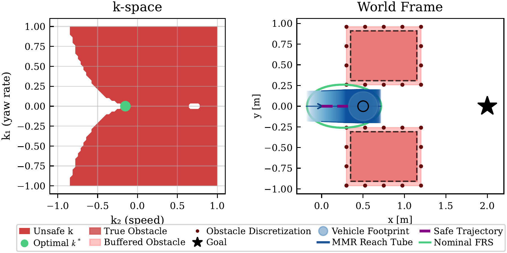

# RTD-RAX


[](https://www.python.org/)
[](https://www.docker.com/)
[](https://www.evannsmc.com)

Official Documentation Website for this project [is found here](https://evannsm.github.io/ws_RTD).

The arXiv preprint of the **`RTD-RAX`** paper [may be found here](https://arxiv.org/abs/2603.21635).

**`RTD-RAX`** is a runtime-assurance extension of Reachability-based Trajectory Design (RTD) that replaces conservative offline reachable sets with fast online safety certification via mixed-monotone reachability ([immrax](https://github.com/gtfactslab/immrax)).


<p align="center">
  <table>
    <tr>
      <td align="center">
        <br>
      </td>
      <td align="center">
        <br>
      </td>
    </tr>
  </table>
  <em>
    Left: Narrow gap scenario. Feasible parameter space <i>k</i> (safe: white, unsafe: red) with selected trajectory <i>k</i><sup>*</sup> in green, and certifiably safe trajectory through the gap. 
    Right: Online repair process under disturbance, showing successive trajectory corrections.
  </em>
</p>

<!-- <p align="center">
  <br>
  <em>Narrow gap scenario. Left: feasible parameter space <i>k</i> (safe: white, unsafe: red) with selected trajectory <i>k</i><sup>*</sup> in green. Right: certifiably safe trajectory through the gap.</em>
</p> -->

RTD is a provably safe, real-time motion planning framework that precomputes Forward Reachable Sets (FRS) offline and uses them online to optimize for collision-free trajectories. The catch: because high-fidelity models are too expensive for reachable-set computation, RTD uses simplified models and inflates the FRS with worst-case tracking-error bounds. This makes the planner overly conservative — it rejects safe trajectories, triggers unnecessary braking, and cannot handle disturbances (wind, ice, slippage) that weren't anticipated offline.

`RTD-RAX` fixes this by splitting the problem: RTD's offline reachable sets handle fast candidate generation *without* conservative inflation, while a separate online verifier built on mixed-monotone reachability certifies each candidate under the actual measured uncertainty and disturbance bounds. If a candidate can't be certified safe, a repair procedure modifies it until a safe alternative is found.

1. **Plan** — use the uninflated FRS to rapidly generate candidate trajectories.
2. **Verify** — certify each candidate online via mixed-monotone reachability under current conditions.
3. **Repair** — if unsafe, modify the candidate and re-verify before execution.

## Key Results

- Safe trajectory planning under a priori unknown disturbances
- Reduction in conservatism compared to standard RTD, enabling navigation through narrow corridors and around angled obstacles
- Elimination of needless fail-safe maneuvers present in standard RTD
- Real-time verification and repair under measured disturbance bounds
- Demonstrated on a 4D unicycle model with three case studies

## Quick Start

All case studies run inside a Docker container with pre-installed dependencies (JAX, immrax, matplotlib, etc.).

```bash
cd docker/
make build
make run_gui          # starts container with X11 forwarding for plots
make rtd-gap          # standard FRS — too conservative, no path found
make rtd-gap FRS=noerror   # noerror FRS — feasible path found
```

For GUI plotting on Linux/X11, allow Docker access first:

```bash
xhost +local:docker
```

After finishing, revoke access:

```bash
xhost -local:docker
```

## Case Studies

All `make` targets are run from the `docker/` directory.

### Study 1: Gap Scenario

Two rectangular obstacles leave a narrow gap. Standard RTD is too conservative to pass; RTD-RAX uses the noerror FRS plus immrax verification to certify a safe path through.

```bash
make manuscript-case1-gap-suite
```


### Study 2: Angled Obstacles with Repair

Angled obstacles require complex trajectories. The noerror FRS proposes candidates that may be unsafe under uncertainty — immrax catches the collision risk, and the hybrid repair loop finds safer alternatives.

```bash
make rtd-case2-suite
make manuscript-case2-suite
```

<!--  -->


### Study 3: Disturbance Compare

A randomized multi-gap course with disturbance patches. Standard RTD collides on cycle 3; RTD-RAX detects the risk via immrax, repairs, and reaches the goal safely.

| Planner | Outcome | Cycles | Repairs | Mean / p95 Compute |
|---|---|---|---|---|
| Standard RTD | Collision (cycle 3) | 3 | -- | 10.5 ms / 21.9 ms |
| RTD-RAX | Goal reached | 19 | 3 | 10.5 ms / 37.4 ms |

```bash
make rtd-disturbance-compare
make manuscript-disturbance-gallery
```


## Repository Structure

```
rtd_rax/
├── turtlebot_rtd_numpy/          # Core RTD-RAX implementation (NumPy/SciPy)
│   ├── one_shot_rtd.py           # Basic single-shot planner
│   ├── one_shot_rtd_gap.py       # Gap scenario with immrax verification
│   ├── rtd_gap_journey.py        # Multi-step receding-horizon replanning
│   ├── rtd_gap_journey_compare.py        # Standard vs noerror comparison with repair
│   ├── rtd_angled_obstacle_compare.py    # Angled obstacle scenario with repair
│   ├── rtd_random_disturbance_compare.py # Disturbance course comparison
│   ├── immrax_verify.py          # immrax reachability verification
│   ├── disturbance_case_study_utils.py   # Shared utilities for case studies
│   ├── frs_loader.py             # FRS .mat file loader
│   ├── constraints.py            # FRS polynomial constraint builder
│   ├── cost.py                   # Trajectory cost function
│   ├── polynomial_utils.py       # Polynomial evaluation utilities
│   ├── geometry_utils.py         # Obstacle geometry helpers
│   ├── trajectory.py             # Trajectory generation
│   └── turtlebot_agent.py        # Turtlebot agent simulation
├── python_preprocessed_frs/      # Precomputed FRS data files (.mat)
├── docker/                       # Docker setup and make targets
│   ├── Dockerfile
│   ├── makefile                  # All experiment and figure targets
│   ├── requirements.txt
│   └── README.md                 # Detailed Docker reference
└── README.md
```

## Make Targets

### Core Experiments

| Target | Description |
|---|---|
| `rtd-gap` | Gap scenario (`FRS=standard` or `FRS=noerror`) |
| `rtd-gap-verify` | Gap scenario with immrax verification |
| `rtd-journey-gap-compare` | Journey comparison with verification and repair |
| `rtd-case2-suite` | Case 2 representative + two-repair outputs |
| `rtd-disturbance-compare` | Disturbance course comparison |

### Manuscript Figures

| Target | Description |
|---|---|
| `manuscript-case1-gap-suite` | Case 1 GIF/PDF family |
| `manuscript-case2-suite` | Case 2 GIF/PDF family |
| `manuscript-disturbance-gallery` | Disturbance comparison outputs |
| `manuscript-figures` | Regenerate all manuscript assets |

### Common Parameters

| Variable | Default | Description |
|---|---|---|
| `FRS` | `standard` | FRS variant (`standard` or `noerror`) |
| `UNCERTAINTY` | `0.01` | immrax positional uncertainty (m) |
| `DISTURBANCE` | `0.0` | Bounded additive disturbance |
| `JOURNEY_VERIFY` | `0` | Enable immrax verification (`1` to enable) |
| `JOURNEY_REPAIR` | `0` | Enable hybrid repair (`1` to enable) |

```bash
# Example: gap verification with custom uncertainty
make rtd-gap-verify FRS=noerror UNCERTAINTY=0.05 DISTURBANCE=0.01
```

See [`docker/README.md`](docker/README.md) for the full target and parameter reference.

## Container Lifecycle

| Command | Description |
|---|---|
| `make build` | Build the Docker image |
| `make run` | Start container (headless) |
| `make run_gui` | Start container with X11 forwarding |
| `make start` | Restart a stopped container |
| `make stop` | Stop the running container |
| `make attach` | Attach a shell to the running container |

## Dependencies

Installed automatically by Docker:

- [NumPy](https://numpy.org/), [SciPy](https://scipy.org/), [Matplotlib](https://matplotlib.org/), [Shapely](https://shapely.readthedocs.io/)
- [JAX](https://jax.readthedocs.io/) (CPU)
- [immrax](https://github.com/gtfactslab/immrax) — interval-arithmetic reachability library

## License

MIT

## Website

This project is part of the [evannsmc open-source portfolio](https://www.evannsmc.com/projects).
